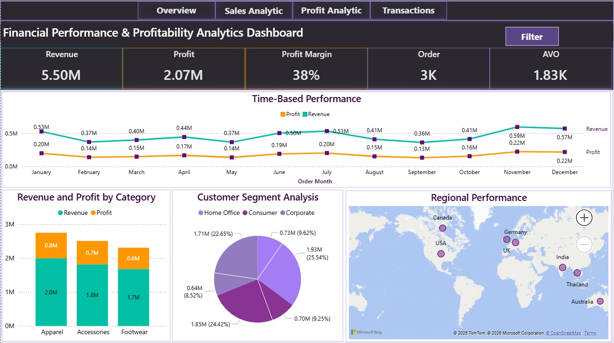

# Financial Performance & Profitability Analytics Dashboard

## 📊 Overview
This dashboard provides a comprehensive view of business performance, profitability, and customer insights.  
It is designed to help decision-makers quickly identify trends, evaluate category contributions, and analyze customer and regional performance.

## 🚀 Key Features
- **Executive KPIs**: Revenue (5.50M), Profit (2.07M), Profit Margin (38%), Orders (3K), Average Order Value (1.83K).
- **Time-Based Performance**: Monthly revenue and profit trends from January to December.
- **Category Analysis**: Apparel, Accessories, and Footwear contribution to revenue and profit.
- **Customer Segments**: Distribution across Home Office, Consumer, Corporate, and other segments.
- **Regional Insights**: Performance across North America, Europe, and Asia-Pacific regions.

## 🛠️ Tech Stack
- **Power BI**: Dashboard development, DAX measures, and Power Query transformations.
- **Excel**: Supporting analysis and validation.

## 📈 Insights
- Revenue and profit peaked in **November & December**, indicating strong seasonal demand.
- **Apparel** leads in both revenue and profit contribution.
- **Consumer segment** drives the largest share of revenue (25.54%).
- Regional performance highlights opportunities in **USA, UK, and India**.

## 🎯 Purpose
This dashboard is built to:
- Enable **data-driven decision-making**.
- Provide **actionable insights** for sales, marketing, and supply chain teams.
- Support **strategic planning** with clear profitability metrics.

---
## 📁 Project Structure

- `Datasets/` → Raw and processed data  
- `Dashboard/` → Power BI dashboard file  
- `Images/` → Dashboard preview  
- `README.md` → Project documentation 

---
## 📸 Dashboard Preview

---

## 📌 How to Use
1. Open the `.pbix` file in Power BI Desktop.
2. Connect to your data source.
3. Refresh to view updated insights.

---

